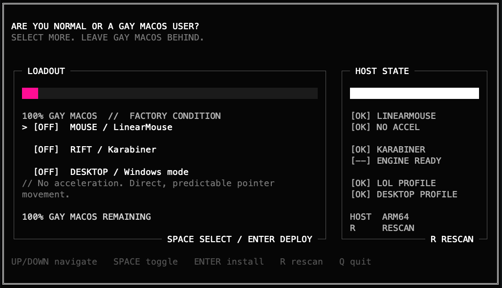

# macos-windows-lol-tui

<p align="center">
  
</p>

An animated monochrome [OpenTUI](https://opentui.com) installer that makes mouse and
keyboard behavior on macOS feel closer to Windows, with a dedicated League of
Legends mode.

## Preview

<p align="center">
  
</p>

## Modules

The TUI lets you combine three independent modules:

| Module | What it changes |
| --- | --- |
| Mouse / LinearMouse | Installs LinearMouse and disables pointer acceleration for mouse devices. |
| Rift / Karabiner | Maps Command-position keys to Option/Alt only while the LoL game client is frontmost. |
| Desktop / Windows mode | Recreates Windows-style modifier behavior outside LoL. |

The League rule matches only:

```text
com.riotgames.LeagueofLegends.GameClient
```

The Desktop rule explicitly excludes that bundle, so it does not conflict with
the in-game layout. League keeps its normal bindings: `Ctrl+Q/W/E/R` levels an
ability and `Alt+Q/W/E/R` self-casts. Inside the game, `Alt+Tab` is translated
to macOS `Command+Tab`, so the physical Windows-style chord still switches
applications.

Desktop mode uses the original Windows-like desktop mapping:

| Physical key | Output outside LoL | Output inside LoL |
| --- | --- | --- |
| Left Control | Command | Control |
| Left Command | Control | Option/Alt |
| Right Command | Option/Alt | Option/Alt |

## Run

Requirements: macOS, Homebrew, and Bun 1.3 or newer.

```bash
brew install bun
git clone https://github.com/mnsosa/macos-windows-lol-tui.git
cd macos-windows-lol-tui
bun install --frozen-lockfile
bun start
```

Controls:

```text
Up/Down or j/k   navigate
Space            toggle a module
Enter            install selected modules
R                rescan system diagnostics
q or Escape      quit
```

The interface opens with `ARE YOU NORMAL OR A GAY MACOS USER?` and includes
a sliding entrance, an animated gay-macOS meter driven by the number of
selected modules, and an animated deployment indicator. The interface remains
monochrome except for the meter: pink below 50%, violet above 50% but below
100%, and blue at 100% gay macOS.

A right-hand diagnostic sidebar scans the current machine without changing it:

- LinearMouse installation and disabled-acceleration preset.
- Karabiner installation and virtual keyboard engine readiness.
- LoL-only and desktop-wide managed rule status.

Diagnostics refresh automatically after installation or manually with `R`.

## Safety

- Existing LinearMouse and Karabiner files are backed up under
  `~/.config/macos-windows-lol-tui/backups/<timestamp>/`.
- Karabiner rules are merged into the selected profile; unrelated rules and
  device settings are preserved.
- The three legacy global modifier pairs from the previous repository are
  migrated to scoped rules; other simple modifications remain untouched.
- Running the same selection repeatedly is idempotent and does not duplicate
  managed rules.
- Applications are installed through Homebrew only when absent.
- The installer never edits League's `input.ini`.

Preview every action without changing the machine:

```bash
bun run src/index.ts --apply=mouse,lol,global --dry-run
```

## Permissions

Karabiner requires explicit macOS approval. After installation, open
**Karabiner-Elements > Setup** and enable every required item. Current macOS
versions require both background services under **System Settings > General >
Login Items & Extensions > App Background Activity**:

```text
Karabiner-Elements Non-Privileged Agents v2
Karabiner-Elements Privileged Daemons v2
```

The TUI opens Karabiner after writing the rules, but macOS requires the user to
approve security permissions.

## Presets

Human-readable copies of the managed settings are included in:

- `presets/linearmouse-windows.json`
- `karabiner/league-windows-modifiers.json`
- `karabiner/global-windows-modifiers.json`

The LinearMouse preset applies `disableAcceleration: true` to mouse devices.
The original Ultra-Link 8K configuration used the same setting but was tied to
vendor `0x362d` and product `0xd028`; this preset uses the mouse category so it
also benefits other devices.

## Build

Create a standalone macOS executable containing Bun and OpenTUI:

```bash
bun run typecheck
bun test
bun run build
./dist/macos-windows-lol-tui
```

Dependencies are pinned in `package.json` and `bun.lock`.

## License

MIT
